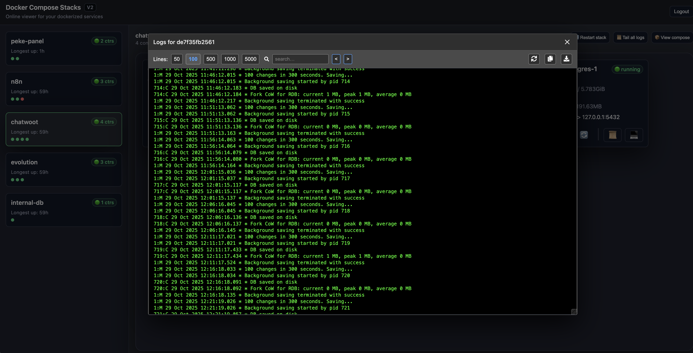
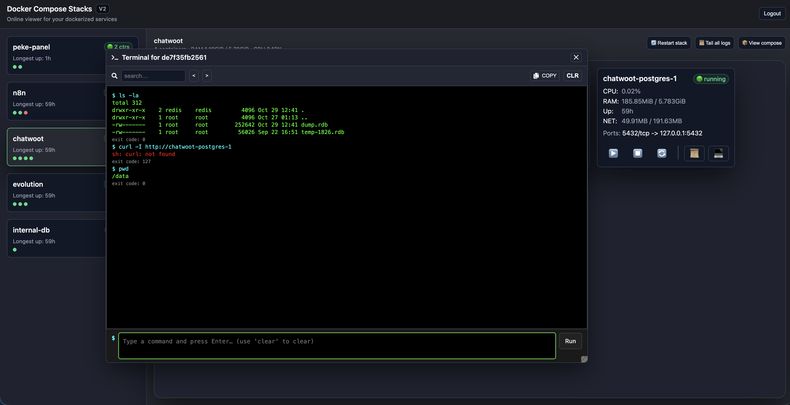

# Peke Panel

Peke Panel is a monitoring and management tool for Docker containers and stacks. It provides a web interface to visualize the status of services, their resource consumption (CPU, RAM), and perform basic actions on them.


## Architecture

The project follows a client-server architecture:

-   **Backend**: A RESTful API developed in **Python** with **FastAPI**. It communicates directly with the host's Docker daemon to get real-time information and execute commands. It uses an in-memory snapshot system to minimize load and optimize responses.
-   **Frontend**: A Single Page Application (SPA) developed in **JavaScript** with **React**. It offers an interactive dashboard to visualize Docker Compose stacks, the containers within each stack, and their relationships.

## Main Features

-   **Stack Visualization**: Automatically lists all running Docker Compose stacks.
-   **Container Monitoring**: Displays the status (running, stopped, unhealthy), CPU, and memory usage for each container.
-   **Container Actions**: Start, stop, and restart containers directly from the interface.
-   **Log Visualization**: Allows viewing the logs of any container in real-time.
    
-   **Interactive Terminal**: Open a shell session (`sh`) inside a running container.
    

## How to Run

The project is fully containerized. Before starting, create a `.env` file from the `.env.example` and define the environment variables.

### Development Mode

Ideal for working on the code. It uses Docker volumes to reflect changes instantly (hot-reloading) in both the backend and frontend.

1.  **Start the services**:
    ```bash
    docker-compose up -d
    ```

2.  **Access the application**:
    -   Frontend: `http://localhost:3000`
    -   Backend API: `http://localhost:8000/docs`

### Production Mode

Creates optimized builds and does not use volumes for the source code, making it the recommended way for a stable deployment.

1.  **Start the services**:
    ```bash
    docker-compose -f docker-compose.production.yml up -d
    ```

2.  **Access the application**: The frontend will be exposed on the port you define in the `FRONTEND_PORT` variable of your `.env` file (by default, port 80 is not exposed publicly, only on localhost).

---

## Server Deployment (Reverse Proxy)

To securely expose Peke Panel on a server, it is recommended to use a reverse proxy to manage traffic and SSL certificates. In production mode, the frontend is only accessible from `localhost`, so the reverse proxy must point to the port defined in `FRONTEND_PORT`.

The backend API (`/api/*`) must be redirected to the backend service, which is not publicly exposed in production mode.

### Caddy Example

Caddy is a modern web server that automates HTTPS management. Create a `Caddyfile` with the following configuration:

```caddy
yourdomain.com {
    # Redirect API traffic to the backend
    handle /api/* {
        reverse_proxy localhost:8000
    }

    # Serve the frontend and handle SPA routes
    handle {
        reverse_proxy localhost:3001 # Replace 3001 with your FRONTEND_PORT
    }
}
```

### Nginx Example

Set up a new `server` block in your Nginx configuration:

```nginx
server {
    listen 80;
    server_name yourdomain.com;

    # Optional: Redirect HTTP to HTTPS (recommended with Certbot)
    # listen 443 ssl;
    # ssl_certificate /path/to/your/fullchain.pem;
    # ssl_certificate_key /path/to/your/privkey.pem;

    location /api/ {
        proxy_pass http://localhost:8000;
        proxy_set_header Host $host;
        proxy_set_header X-Real-IP $remote_addr;
        proxy_set_header X-Forwarded-For $proxy_add_x_forwarded_for;
    }

    location / {
        proxy_pass http://localhost:3001; # Replace 3001 with your FRONTEND_PORT
        proxy_set_header Host $host;
        proxy_set_header X-Real-IP $remote_addr;
        proxy_set_header X-Forwarded-For $proxy_add_x_forwarded_for;
        proxy_set_header Upgrade $http_upgrade;
        proxy_set_header Connection "upgrade";
    }
}
```